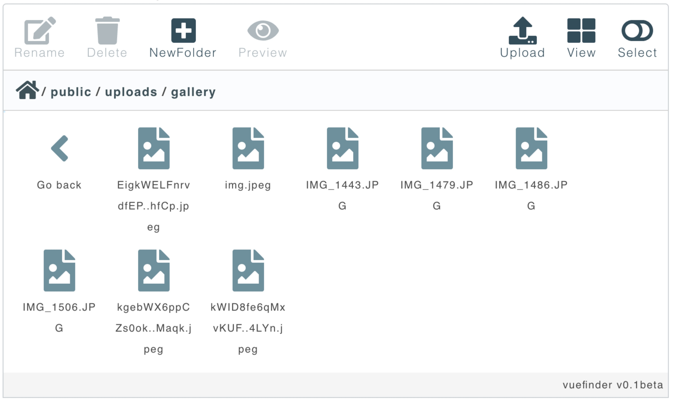

# Vuefinder File Manager

#### Readme in progress..

The project is also still in its early stages. 

#### List of dependencies:

   - @fortawesome/fontawesome-svg-core,
   - @fortawesome/free-solid-svg-icons,
   - @fortawesome/vue-fontawesome,
   - axios,
   - moment,
   - dragselect,
   - vue

#### Installation
```
npm install vuefinder
```

#### Usage

````javascript
    import Vue from 'vue';
    import vuefinder from 'vuefinder/src/Finder.vue';

    Vue.component('vuefinder', vuefinder);

    var app = new Vue({
        el: '#app'
    });
````

When you register the sfc component it will be available as simple as the code below.

````vue
<div id="app">
    <vuefinder url="vuefinder" ></vuefinder>
</div>
````

#### Server-Side php library 

[vuefinder-php](https://github.com/n1crack/vuefinder-php) //  still in progress..

#### Meanwhile the project screenshot:



#### and youtube video of first version

[](https://www.youtube.com/watch?v=QV0H3NzmQVQ)

#### So..
Let me hear what do you think of the project?
